# 动态系统建模复习文档

## 引言
动态系统建模是控制理论的核心，它帮助我们理解和分析系统在时间或频率域中的行为。通过数学模型，我们可以预测系统响应、设计控制器并优化性能。本复习文档将详细探讨线性时不变系统、卷积、拉普拉斯变换、传递函数、状态空间方程、时域响应和频率响应等关键概念，侧重于直观理解和实际应用，数学推导将尽量简化。

动态系统建模不仅限于理论分析，更是工程实践中不可或缺的工具。从航空航天器的姿态控制到工业过程的自动化，从机器人轨迹规划到生物医学信号处理，动态系统建模为复杂系统的分析、设计和优化提供了数学基础。

---
## 线性时不变系统
线性时不变（LTI）系统是控制理论的基础，因为它们满足叠加原理和时不变性。**叠加原理**意味着系统对多个输入之和的响应等于各自响应的和，例如，如果输入 \(u_1(t)\) 产生输出 \(y_1(t)\)，输入 \(u_2(t)\) 产生输出 \(y_2(t)\)，那么输入 \(u_1(t) + u_2(t)\) 会产生输出 \(y_1(t) + y_2(t)\)。**时不变性**表明系统特性不随时间变化，因此输入延迟会导致输出延迟，但响应形状不变。

LTI系统的数学特性使其分析变得相对简单：
- 可以用常系数线性微分方程描述
- 系统响应可以完全由冲激响应表征
- 在频域分析中具有简洁的表达式

LTI系统通常用微分方程、传递函数或状态空间方程描述，这使得分析和设计控制器变得简单。在实际应用中，LTI系统常见于电路、机械系统和信号处理中，例如，低通滤波器或质量-弹簧-阻尼系统都是LTI系统的例子。

**工程应用实例**：在音频处理中，均衡器可以建模为LTI系统，不同频段的增益调整满足叠加原理，且系统特性不随时间变化。

---

## 卷积
卷积是描述LTI系统输入与输出关系的重要数学工具。对于LTI系统，输出 \(y(t)\) 是输入 \(u(t)\) 和系统单位冲激响应 \(h(t)\) 的卷积：
\[
y(t) = u(t) * h(t) = \int_{-\infty}^{\infty} u(\tau) h(t - \tau)  d\tau
\]

**卷积的物理意义**：可以将卷积理解为输入信号在时间轴上移动时，与系统冲激响应的"加权叠加"。每个时刻的输入都对未来输出有贡献，权重由冲激响应决定。

卷积运算允许我们将系统响应分解为输入信号与系统冲激响应的叠加，从而简化系统分析。例如，在信号处理中，卷积用于实现滤波器；在控制系统中，它帮助理解系统对任意输入的响应，而不必直接求解微分方程。

应用方面，卷积在图像处理（如模糊效果）和音频处理（如回声模拟）中也有广泛应用。理解卷积的关键是认识到它代表了输入信号在时间上的"滑动"加权平均，其中权重由冲激响应决定。

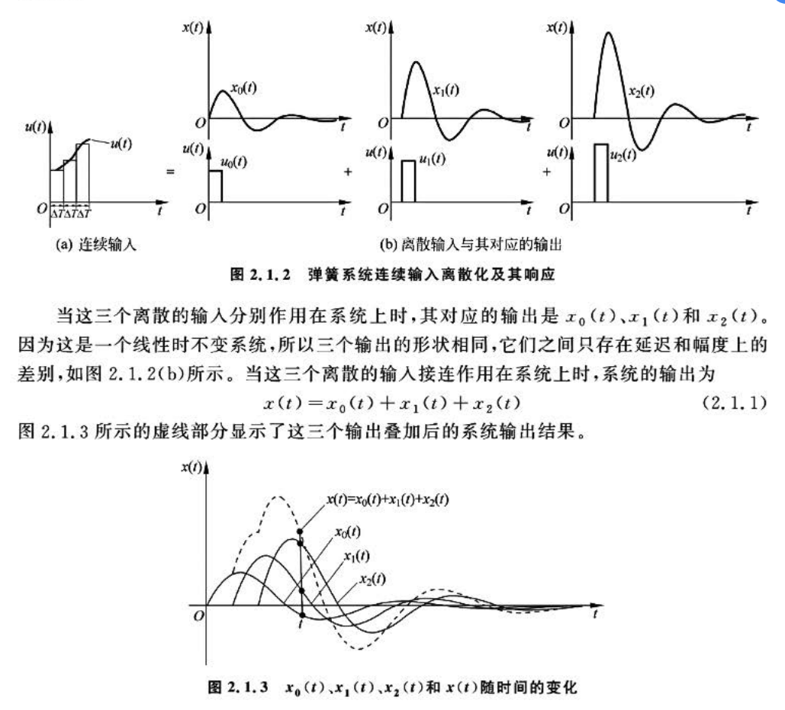

**数值计算提示**：在实际工程中，连续卷积通常离散化计算，离散卷积公式为：
\[
y[n] = \sum_{k=-\infty}^{\infty} u[k] h[n-k]
\]

---
## 传递函数
传递函数是LTI系统在**零初始条件**下，输出拉氏变换与输入拉氏变换的比值，即 \(G(s) = \frac{Y(s)}{U(s)}\)。它描述了系统的频域特性，极点和零点决定系统稳定性和响应形状。

**传递函数的核心特性**：
- 仅适用于线性时不变系统
- 假设初始条件为零
- 提供输入输出关系的完整描述
- 极点的位置决定系统稳定性

传递函数从微分方程推导而来，例如，对于一阶系统 \(\frac{dx(t)}{dt} + a x(t) = a u(t)\)，传递函数为 \(G(s) = \frac{a}{s+a}\)。传递函数适用于单输入单输出（SISO）系统，并便于分析系统响应和设计控制器，如PID控制器。

在实际应用中，传递函数用于建模滤波器、放大器和其他动态系统。**工程优势**在于可以通过代数运算（而非微分方程求解）来分析系统行为。

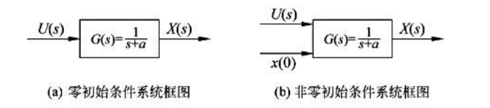

### 非零初始状态的传递函数
当系统有非零初始状态时，传递函数不能直接应用，因为初始条件会影响响应。此时，需要将初始条件视为额外的输入（如冲激输入），并通过拉普拉斯变换处理。

**处理方法**：
1. 在拉普拉斯变换中显式包含初始条件项
2. 将响应分解为零输入响应和零状态响应
3. 使用状态空间方法直接处理初始状态

例如，对于一阶系统 \(\frac{dx(t)}{dt} + a x(t) = u(t)\)，若初始条件为 \(x(0) = x_0\)，拉普拉斯变换后可得 \(sX(s) - x_0 + aX(s) = U(s)\)，因此 \(X(s) = \frac{U(s) + x_0}{s+a}\)。这表示响应由零输入响应（由初始条件引起）和零状态响应（由输入引起）组成。

在实际控制设计中，初始条件常通过状态空间方法处理，或者在设计阶段确保系统能够快速收敛到期望状态。

---
## 单位冲激函数与冲激响应

### 单位冲激函数
单位冲激函数（Dirac delta function）是描述瞬时作用的数学工具，定义为宽度趋于零、面积恒为1的极限函数。其数学表达式为：  
\[
\delta(t) = \lim_{\Delta T \to 0} \delta_{\Delta}(t), \quad \int_{-\infty}^{\infty} \delta(t)  dt = 1  
\]
其中 $\delta_{\Delta}(t)$ 是宽度为 $\Delta T$、高度为 $1/\Delta T$ 的矩形脉冲。冲激函数具有筛选性质：  
\[\int_{-\infty}^{\infty} x(t) \delta(t - \tau)  dt = x(\tau)  \]
即冲激函数在 $\tau$ 处"采样"信号 x(t) 的值。

**工程理解**：冲激函数可以理解为在极短时间内作用的极大强度的脉冲，如锤击、电火花等物理现象的数学模型。

### 冲激响应
冲激响应 **h(t)** 是线性时不变（LTI）系统对单位冲激输入 $\delta(t)$ 的零状态响应。其重要性在于：  

1. **完全表征系统特性**：冲激响应包含LTI系统的全部动态信息，系统对任意输入 u(t) 的输出可通过卷积运算得到：  
   \[y(t) = u(t) * h(t) = \int_{-\infty}^{\infty} u(\tau) h(t - \tau)  d\tau  \]

2. **与传递函数的关系**：冲激响应的拉普拉斯变换即为传递函数 G(s)：  
   \[G(s) = \mathcal{L}\{h(t)\}, \quad G(s) = \frac{Y(s)}{U(s)} \bigg|_{U(s)=1}  \]

3. **收敛性决定稳定性**：若 h(t) 随时间收敛（\[\lim_{t \to \infty} h(t) = 0\]），则系统稳定。

### 典型示例

- **一阶系统**：传递函数 $G(s) = \frac{a}{s+a}$ 的冲激响应为 $h(t) = a e^{-at}$。当 a>0 时响应指数衰减（稳定）；a<0 时发散（不稳定）。

- **二阶系统（质量-弹簧-阻尼系统）**
考虑一个经典的**质量-弹簧-阻尼系统**，其传递函数通常表示为：
\[
G(s) = \frac{\omega_n^2}{s^2 + 2\zeta\omega_n s + \omega_n^2}
\]
其中：
- \(\omega_n\) = 无阻尼自然频率 (rad/s)
- \(\zeta\) = 阻尼比 (无量纲)

#### 冲激响应分析
该系统的冲激响应 \(h(t)\) 取决于阻尼比 \(\zeta\) 的值：

**1. 欠阻尼情况 (0 < \(\zeta\) < 1)**
\[
h(t) = \frac{\omega_n}{\sqrt{1-\zeta^2}} e^{-\zeta\omega_n t} \sin(\omega_d t), \quad t \geq 0
\]
其中 \(\omega_d = \omega_n\sqrt{1-\zeta^2}\) 为阻尼自然频率。

**2. 临界阻尼 (\(\zeta\) = 1)**
\[
h(t) = \omega_n^2 t e^{-\omega_n t}, \quad t \geq 0
\]

**3. 过阻尼 (\(\zeta\) > 1)**
\[
h(t) = \frac{\omega_n}{2\sqrt{\zeta^2-1}} \left[ e^{-(\zeta-\sqrt{\zeta^2-1})\omega_n t} - e^{-(\zeta+\sqrt{\zeta^2-1})\omega_n t} \right], \quad t \geq 0
\]

**4. 无阻尼 (\(\zeta\) = 0)**
\[
h(t) = \omega_n \sin(\omega_n t), \quad t \geq 0
\]

#### 物理意义与稳定性
- **欠阻尼**：响应呈现衰减振荡，最终趋于零 → **稳定系统**
- **临界阻尼**：最快无超调的响应 → **稳定系统**  
- **过阻尼**：缓慢无振荡的衰减 → **稳定系统**
- **无阻尼**：持续等幅振荡 → **临界稳定**

#### 数值示例
设 \(\omega_n = 2\) rad/s，不同阻尼比下的冲激响应：
- \(\zeta = 0.3\) (欠阻尼)：\(h(t) = \frac{2}{\sqrt{0.91}} e^{-0.6t} \sin(1.91t)\)
- \(\zeta = 1.0\) (临界阻尼)：\(h(t) = 4t e^{-2t}\)
- \(\zeta = 1.5\) (过阻尼)：\(h(t) = 1.34[e^{-0.54t} - e^{-5.46t}]\)

这个示例清晰地展示了二阶系统在不同阻尼条件下的动态特性，是控制系统分析中的经典案例。

---
## 拉普拉斯变换与拉普拉斯逆变换

### 我们为什么需要拉氏变换？
拉普拉斯变换将时域函数转换为复频域（s域）函数，从而将微分方程转化为代数方程。这大大简化了系统分析和求解过程，因为微分运算在s域中变为乘法运算。

**核心优势**：
1. **微分方程代数化**：将复杂的微分运算转换为简单的代数运算
2. **统一处理瞬态和稳态**：同时包含指数增长/衰减和振荡行为
3. **方便处理初始条件**：在变换过程中自然包含初始状态
4. **稳定性分析直观**：通过极点位置直接判断系统稳定性

例如，求解线性微分方程时，拉氏变换允许我们处理初始条件更简单，并提供系统稳定性分析的直观方式（通过极点的位置）。在实际应用中，拉氏变换用于电路分析、控制系统设计和信号处理，因为它能高效处理瞬态和稳态响应。

**本质是函数变换，将函数从时域转换到复频域**

### 拉氏变换的计算方法
拉普拉斯变换定义为：
\[
\mathcal{L}[f(t)] = F(s) = \int_{0}^{\infty} f(t) e^{-st}  dt
\]
其中 \(s = \sigma + j\omega\) 是复频率。常见函数的拉氏变换可以通过积分计算或查表获得。

**常用变换对**：
- 单位阶跃函数 \(u(t)\): \(\mathcal{L}[u(t)] = \frac{1}{s}\)
- 指数函数 \(e^{at}\): \(\mathcal{L}[e^{at}] = \frac{1}{s-a}\)
- 正弦函数 \(\sin(\omega t)\): \(\mathcal{L}[\sin(\omega t)] = \frac{\omega}{s^2 + \omega^2}\)
- 余弦函数 \(\cos(\omega t)\): \(\mathcal{L}[\cos(\omega t)] = \frac{s}{s^2 + \omega^2}\)
- 单位冲激函数 \(\delta(t)\): \(\mathcal{L}[\delta(t)] = 1\)

计算方法涉及识别函数类型并应用变换公式。对于复杂函数，部分分式展开常用于逆变换。拉氏逆变换从s域返回时域，通常使用部分分式展开和查表法进行，例如，如果 \(F(s) = \frac{1}{s+a}\)，则逆变换为 \(f(t) = e^{-at}\)。

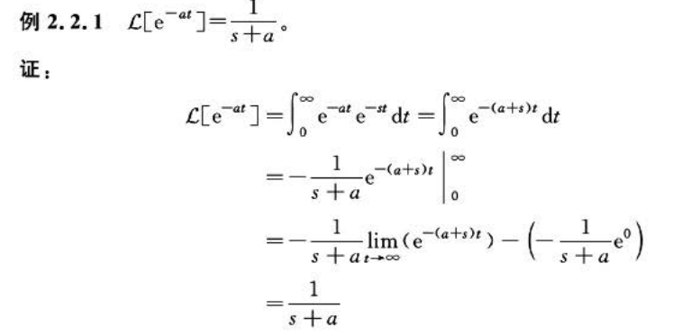

### 拉氏变换表
常用拉氏变换对包括：
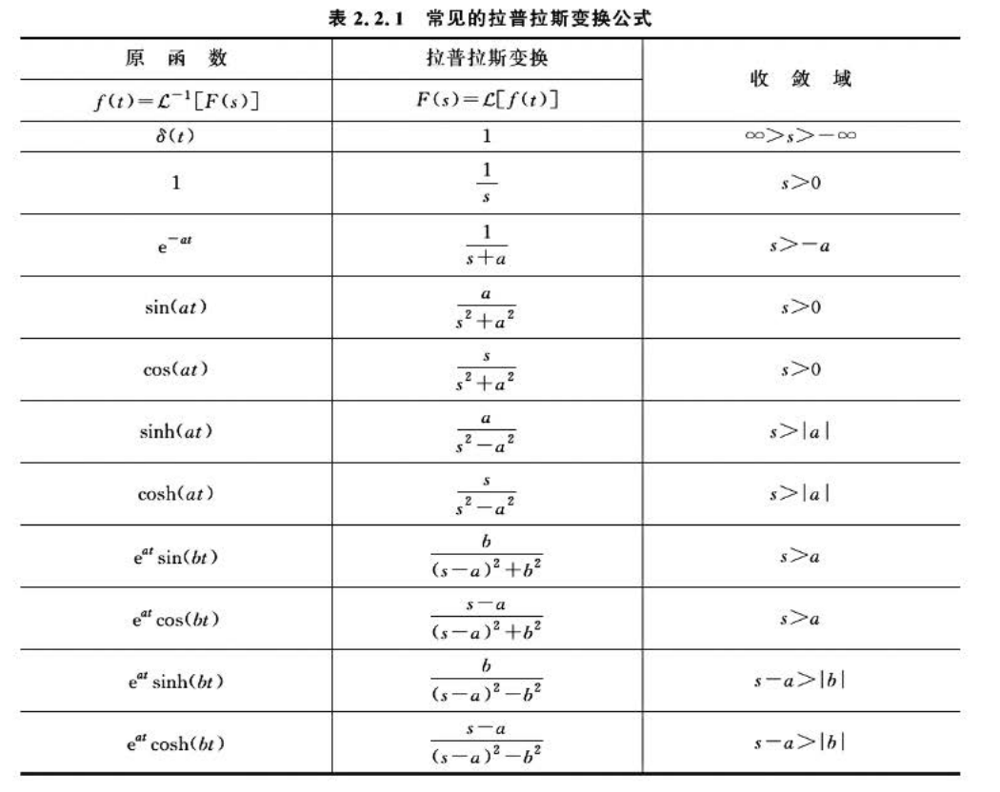

掌握这些变换对可以快速求解微分方程，并在系统分析中节省时间。表格是工程实践中的必备工具，特别是在控制系统设计中。

**实用技巧**：
- 记住几个关键变换对（阶跃、指数、正弦、冲激）
- 掌握线性性质、时移性质、频移性质等基本性质
- 熟练运用部分分式展开法求逆变换

### 收敛域
拉普拉斯变换的收敛域（Region of Convergence, ROC）是指使拉普拉斯变换积分收敛的复数 \( s = \sigma + j\omega \) 的取值范围。其核心特性如下：

1. **定义与作用**  
   收敛域由被变换函数 \( f(t) \) 的增长特性决定。若积分 \( \int_0^\infty f(t)e^{-st} dt \) 收敛，则 \( s \) 属于收敛域。收敛域的存在保证了拉普拉斯变换的数学有效性。

2. **关键性质**  
   - **右边界条件**：收敛域通常是复平面上的带状区域，满足 \( \sigma > \sigma_0 \)（\( \sigma_0 \) 为实常数）。例如，函数 \( e^{-at} \) 的拉普拉斯变换 \( \frac{1}{s+a} \) 的收敛域为 \( \sigma > -a \)（即 \( \text{Re}(s) > -a \)）。  
   - **复指数项的影响**：复指数 \( e^{-j\omega t} \) 的模恒为 1（在复平面单位圆上运动），因此收敛性仅取决于实部 \( \sigma \)。例如，\( e^{-(a+\sigma)t} \) 的收敛要求 \( -(a+\sigma) < 0 \)（即 \( \sigma > -a \)）。  

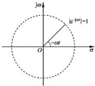

3. **实例说明**  
   以 \( f(t) = e^{-at} \) 为例：  
   - 当 \( a > 0 \) 时，收敛域为 \( \sigma > -a \)（右半平面）；  
   - 若 \( \sigma \leq -a \)（如 \( s = -2a \)），积分发散。  

> 收敛域是拉普拉斯变换分析系统稳定性和动态响应的基础，其边界由函数增长速率决定。

**工程意义**：在控制系统设计中，收敛域直接关联到系统稳定性。所有极点位于左半平面等价于收敛域包含虚轴，这意味着系统是稳定的。

---
## 状态空间方程
状态空间方程用一组一阶微分方程描述系统动态，适用于多输入多输出（MIMO）系统。它包含状态方程和输出方程：
\[
\dot{z}(t) = A z(t) + B u(t)
\]
\[
y(t) = C z(t) + D u(t)
\]
其中 \(z(t)\) 是状态向量（表示系统内部状态），\(u(t)\) 是输入向量，\(y(t)\) 是输出向量。矩阵 \(A\)（系统矩阵）、\(B\)（输入矩阵）、\(C\)（输出矩阵）和 \(D\)（直接传递矩阵）定义了系统行为。

**状态空间方法的优势**：
- 适用于多变量系统
- 能够处理非零初始条件
- 提供系统内部状态的完整信息
- 便于计算机仿真和数值计算

状态空间模型提供了系统内部状态的完整描述，便于设计状态反馈控制器和观测器。例如，在机器人控制中，状态空间用于建模关节位置和速度。

### 状态空间方程与传递函数的关系
传递函数可以从状态空间方程推导出来。对状态方程进行拉氏变换（假设零初始条件），得到：
\[
G(s) = C(sI - A)^{-1}B + D
\]
传递函数的极点对应于矩阵 \(A\) 的特征值，因此系统稳定性由 \(A\) 的特征值决定。

**重要关系**：
- 系统极点 = 矩阵A的特征值
- 系统零点由矩阵A,B,C,D共同决定
- 状态空间实现不唯一，但传递函数唯一

状态空间模型比传递函数更通用，能处理非零初始条件和MIMO系统。例如，对于二阶系统，状态空间可以表示为两个一阶方程，而传递函数是标量函数。转换时，注意状态空间能捕获更多系统内部信息，而传递函数仅关注输入输出关系。

**工程应用**：在现代控制理论中，状态空间方法为最优控制、鲁棒控制等高级控制策略提供了数学框架。

---

### **一阶系统时域响应**

一阶系统是动力学系统中最基本的形式，其核心特征是**系统的状态由一个变量完全描述，且该变量的变化率取决于其当前状态和外部输入**。

**1. 数学模型与物理本质**

- **微分方程**： \(\frac{dx(t)}{dt} + a x(t) = a u(t)\)
    - 这个方程描述了系统状态 \(x(t)\) 的动态。左边第一项是变化率，第二项是恢复力（与状态成正比）；右边是驱动项。
    - 参数 \(a\) 是**恢复系数**，它决定了系统"忘记"初始状态或响应输入的速率。\(a\) 越大，系统恢复或响应的速度越快。

- **传递函数**： \(G(s) = \frac{a}{s + a}\)
    - 这是微分方程在拉普拉斯域的表示，极大地简化了系统分析和互联。
    - **极点**位于 \(s = -a\)。极点在复平面的位置直接决定了系统的稳定性和响应速度。一阶系统的极点总是负实数，保证了系统的稳定性（响应不会发散）。

- **时间常数**： \(\tau = \frac{1}{a}\)
    - 这是理解一阶系统**最核心**的概念。它不是一个时间点，而是一个**速率指标**。
    - **物理意义**：时间常数是系统响应达到其总变化量的63.2%所需的时间。它量化了系统的"惯性"。\(\tau\) 越小，系统惯性越小，响应越快。

**2. 冲激响应**

单位冲激函数 \(\delta(t)\) 可以看作一个幅值无限大、持续时间无限短、面积为1的理想脉冲。它对系统施加了一个瞬间的"能量冲击"。

- **响应公式**： \(x(t) = a e^{-a t} = \frac{1}{\tau} e^{-t / \tau}\)
- **深入理解**：
    - 在 \(t=0^+\) 时刻，响应瞬间跃升至 \(x(0^+) = a = 1/\tau\)。这是因为冲激输入在瞬间将能量注入系统。时间常数 \(\tau\) 越小，这个初始峰值越高，因为能量被更快地注入。
    - 之后，系统在没有外部输入的情况下，仅凭自身的特性（由极点 \(-a\) 决定）进行**指数衰减**，释放其存储的能量。
    - **能量视角**：冲激响应描述了系统的**固有行为**，即系统如何释放其初始能量。它完全由系统的极点决定，与输入无关。
    - **工程应用实例**：
        - **电路**：一个RC电路，初始充电的电容瞬间短路，其放电电流就是冲激响应的一个近似。
        - **结构测试**：用锤子敲击一个机械结构，锤击的力近似一个冲激，通过测量结构的振动响应（冲激响应），可以分析其固有频率和阻尼。

**3. 阶跃响应**

单位阶跃函数 \(u(t)\) 表示一个在 \(t=0\) 时刻突然施加并保持的输入。它测试系统跟踪一个恒定输入的能力。

- **响应公式**： \(x(t) = 1 - e^{-a t} = 1 - e^{-t / \tau}\)
- **深入理解**：
    - 响应从0开始，因为系统状态不能突变（在物理系统中）。
    - 初始斜率：在 \(t=0\) 时刻，响应曲线的斜率为 \(\frac{dx}{dt}\big|_{t=0} = a = 1/\tau\)。这意味着如果系统保持初始速度不变，它将在 \(t=\tau\) 时达到稳态值1。这再次凸显了 \(\tau\) 作为速度指标的意义。
    - **性能指标的物理意义**：
        - **上升时间 \(T_r\)**： 通常定义为从10%到90%稳态值的时间。对于一阶系统，\(T_r \approx 2.2\tau\)。它直接衡量了系统的快速性。
        - **调节时间 \(T_s\)**： 定义为进入并保持在稳态值特定误差带（如±2%）内所需的时间。对于一阶系统，\(T_s = 4\tau\)。这是系统达到"基本稳定"所需的时间。
    - **工程应用实例**：
        - **温度控制**：将恒温箱的温度设定值提高10度，箱内温度的变化过程就是一个阶跃响应。
        - **电机速度控制**：给电机一个固定的电压指令，电机转速从0上升到额定转速的过程也是阶跃响应。

---

### **二阶系统时域响应**

二阶系统包含两个独立的储能元件（如质量和弹簧、电感和电容），能量可以在两者之间交换，从而可能产生振荡。

**1. 数学模型与关键参数**

- **微分方程**： \(\frac{d^2x(t)}{dt^2} + 2\zeta\omega_n \frac{dx(t)}{dt} + \omega_n^2 x(t) = \omega_n^2 u(t)\)
- **传递函数**： \(G(s) = \frac{\omega_n^2}{s^2 + 2\zeta\omega_n s + \omega_n^2}\)
- **关键参数**：
    - **无阻尼自然频率 \(\omega_n\)**： 系统在没有任何阻尼（\(\zeta=0\)）时的自由振荡频率。它反映了系统的"固有速度"，\(\omega_n\) 越大，系统响应越快。
    - **阻尼比 \(\zeta\)**： 衡量系统振荡趋势的**无量纲**参数。它是实际阻尼与临界阻尼的比值，决定了系统的响应模式。

**2. 冲激响应的模式分析**

冲激响应是系统传递函数的拉普拉斯逆变换，其形式完全由极点决定。
- **欠阻尼 (\(0 < \zeta < 1)\)**:
    - 极点为一对共轭复数： \(s = -\zeta\omega_n \pm j\omega_n\sqrt{1-\zeta^2}\)
    - 响应公式： \(x(t) = \frac{\omega_n}{\sqrt{1-\zeta^2}} e^{-\zeta\omega_n t} \sin(\omega_d t)\)，其中 \(\omega_d = \omega_n\sqrt{1-\zeta^2}\) 是**阻尼自然频率**。
    - 响应是一个以频率 \(\omega_d\) 振荡、包络为 \(e^{-\zeta\omega_n t}\) 的指数衰减函数。\(\zeta\omega_n\)（实部）决定了衰减速度，\(\omega_d\)（虚部）决定了振荡频率。
- **临界阻尼 (\(\zeta = 1)\)**:
    - 极点为一个重实数极点： \(s = -\omega_n\)
    - 响应公式： \(x(t) = \omega_n^2 t e^{-\omega_n t}\)
    - 这是响应能够无超调地回到稳态的**最快**情况。系统处于振荡与不振荡的边界。
- **过阻尼 (\(\zeta > 1)\)**:
    - 极点为两个不等的负实数极点。
    - 响应可视为两个一阶系统响应的叠加： \(x(t) = A e^{-s_1 t} + B e^{-s_2 t}\)
    - 响应缓慢、无振荡地趋于零。系统的行为由两个时间常数中较慢的那个（离虚轴更近的极点）主导。

**3. 阶跃响应的性能权衡**

阶跃响应是评估控制系统性能（如伺服系统）的最常用方法。

- **欠阻尼响应 (\(0 < \zeta < 1)\)**:
    - **上升时间 \(T_r\)**： 随 \(\zeta\) 增大而增大（更慢），随 \(\omega_n\) 增大而减小（更快）。
    - **峰值时间 \(T_p\)**： \(T_p = \frac{\pi}{\omega_n \sqrt{1-\zeta^2}}\)。与阻尼自然频率成反比。
    - **超调量 \(M_p\)**： \(M_p = e^{-\pi\zeta / \sqrt{1-\zeta^2}} \times 100\%\)
        - 这是一个非常重要的关系式。当 \(\zeta=0.7\) 时，\(M_p \approx 5\%\)。这是许多控制系统设计的黄金折中点，因为它提供了较快的响应和较小的超调。
    - **调节时间 \(T_s\)**： 近似为 \(T_s \approx \frac{4}{\zeta\omega_n}\)（对于±2%误差带）。它由系统的实部 \(-\zeta\omega_n\) 决定。

- **设计哲学**：
    - 追求**快速性**（小 \(T_r, T_p\)）需要大的 \(\omega_n\) 和小的 \(\zeta\)。
    - 追求**平稳性**（小 \(M_p\)，小 \(T_s\)）需要大的 \(\zeta\)。
    - 这是一个经典的**权衡（Trade-off）**。工程师需要根据具体应用的需求来选择参数。例如，导弹姿态控制系统可能需要快速响应而容忍一定超调（小 \(\zeta\)），而电梯的升降控制系统则必须严格避免超调（\(\zeta \geq 1\)）。

---

### **频率响应数学推导**

#### **正弦输入与系统响应**
- **输入信号**：\( u(t) = M_i \sin(\omega_i t + \varphi_i) \)
- **系统输出稳态响应**：
  \[
  x_{ss}(t) = M_o \sin(\omega_i t + \varphi_o), \quad \text{其中} \quad \frac{M_o}{M_i} = |G(j\omega_i)|, \quad \varphi_o = \angle G(j\omega_i) + \varphi_i
  \]
- **结论**：线性时不变系统对正弦输入的稳态响应是同频率正弦波，振幅缩放 \( |G(j\omega_i)| \) 倍，相位偏移 \( \angle G(j\omega_i) \)。

#### **关键公式推导**
1. **系统传递函数**：\( G(s) = \frac{X(s)}{U(s)} \)
2. **输入拉普拉斯变换**：\( U(s) = \mathcal{L}[u(t)] = \frac{M_i \omega_i}{s^2 + \omega_i^2} \)
3. **输出表达式**：
   \[
   X(s) = G(s) U(s) = G(s) \frac{M_i \omega_i}{s^2 + \omega_i^2}
   \]
4. **稳态响应推导**（终值定理）：
   - 通过部分分式分解和拉普拉斯逆变换，得到：
     \[
     x_{ss}(t) = |G(j\omega_i)| M_i \sin(\omega_i t + \angle G(j\omega_i) + \varphi_i)
     \]
   - **几何解释**（图9.2.4）：  
     \( G(j\omega_i) \) 是复平面向量，模长 \( |G(j\omega_i)| \) 为增益，辐角 \( \angle G(j\omega_i) \) 为相位偏移。
---
### **一阶系统频率响应**

#### **传递函数与频率特性**
- **系统模型**：\( G(s) = \frac{a}{s + a} \)（低通滤波器）
- **幅频响应**：
  \[
  |G(j\omega_i)| = \sqrt{\frac{1}{\left(\frac{\omega_i}{a}\right)^2 + 1}}
  \]
- **相频响应**：
  \[
  \angle G(j\omega_i) = -\arctan\left(\frac{\omega_i}{a}\right)
  \]
- **特性曲线**（图9.3.2）：
  - 截止频率 \( \omega_c = a \)（振幅衰减至 -3dB）。
  - 低频段（\( \omega_i \ll a \)）：增益 ≈1，相位偏移 ≈0°。
  - 高频段（\( \omega_i \gg a \)）：增益以 -20dB/十倍频衰减，相位偏移 → -90°。

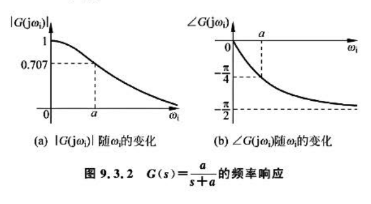

#### **应用示例：噪声滤波**
- **场景**：信号 \( \sin t \)（\( \omega_i=1 \)）叠加高频噪声。
- **滤波器设计**：选 \( a=1 \)，\( G(s) = \frac{1}{s+1} \)。
- **效果**：
  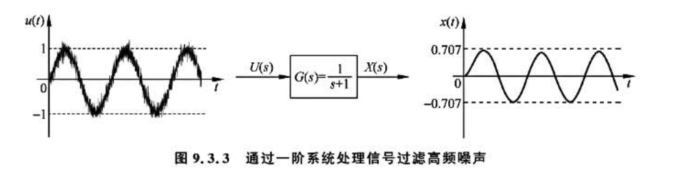
  - 有用信号振幅衰减至 0.707，但保留形态。
  - 高频噪声被显著抑制。

---

### **二阶系统频率响应**

#### **传递函数与共振现象**
- **系统模型**：\( G(s) = \frac{\omega_n^2}{s^2 + 2\zeta\omega_n s + \omega_n^2} \)
- **幅频响应**：
  \[
  |G(j\omega_i)| = \frac{1}{\sqrt{\left(1 - \left(\frac{\omega_i}{\omega_n}\right)^2\right)^2 + \left(2\zeta\frac{\omega_i}{\omega_n}\right)^2}}
  \]
- **共振频率**（当 \( \zeta < 0.707 \)）：
  \[
  \omega_R = \omega_n \sqrt{1 - 2\zeta^2}
  \]
- **特性曲线**：
  - \( \zeta = 0 \)：无阻尼振荡，\( \omega_i = \omega_n \) 时增益 → ∞。
  - \( \zeta > 0.707 \)：无共振峰，增益单调衰减。

#### **物理意义**
- **共振案例**：塔科马海峡大桥因风载频率接近结构固有频率倒塌。
- **阻尼比影响**：\( \zeta \) 越小，共振峰越尖锐，系统对频率选择性越强。

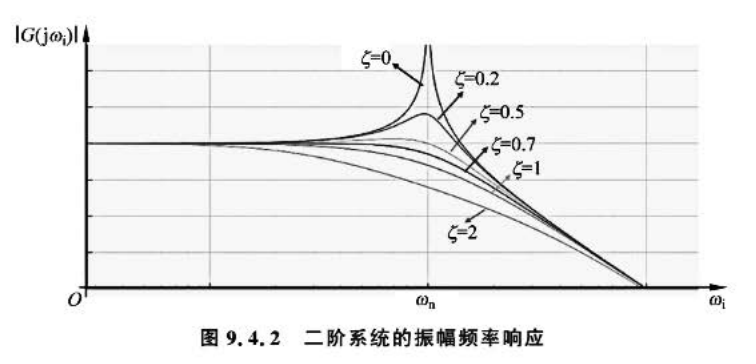

---

### **伯德图（Bode Plot）**

#### **定义与绘制规则**
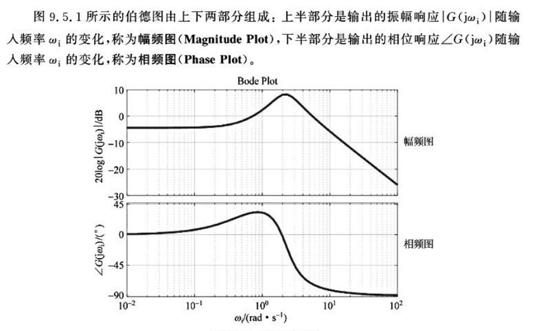
- **幅频图**：纵轴 \( 20\log|G(j\omega_i)| \)（dB），横轴 \( \log\omega_i \)。
- **相频图**：纵轴 \( \angle G(j\omega_i) \)（度），横轴 \( \log\omega_i \)。
- **典型系统伯德图**：
  - **积分器**（\( G(s) = \frac{1}{s} \)）：幅频斜率 -20dB/dec，相位恒为 -90°。
  - 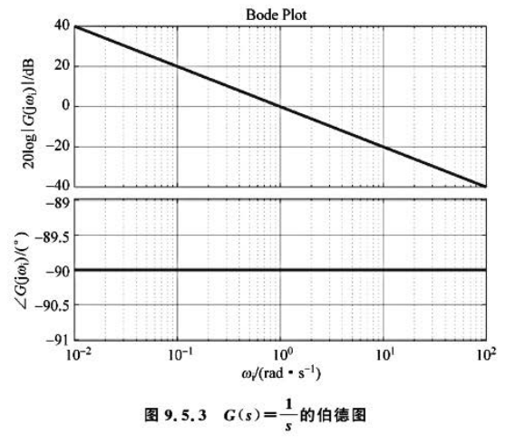
  - **一阶系统**（\( G(s) = \frac{a}{s+a} \)）：幅频渐近线交于 \( \omega = a \)，相位从 0° 至 -90°。
  - 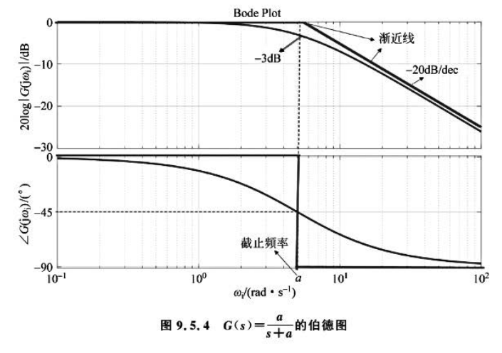
  - **PD控制器**（\( G(s) = \frac{s}{a} + 1 \)）：高通特性，相位超前。
  - 

#### **级联系统分析**
- **传递函数分解**：
  \[
  G(s) = \frac{s+1}{s+10} = \underbrace{\frac{1}{10}}_{G_1} \cdot \underbrace{(s+1)}_{G_2} \cdot \underbrace{\frac{1}{0.1s + 1}}_{G_3}
  \]
  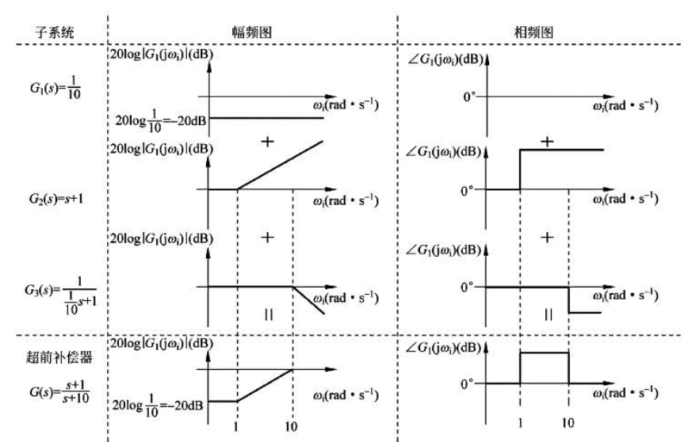
- **伯德图叠加**：
  - 总伯德图 = \( G_1 \)（常数增益） + \( G_2 \)（高通） + \( G_3 \)（低通）。

---

### **关键概念总结**

| **概念**          | **数学表达**                          | **物理意义**                     |
|--------------------|---------------------------------------|----------------------------------|
| **幅频响应**       | \( G(j\omega_i) \)           | 系统对不同频率信号的增益       |
| **相频响应**       | \( \angle G(j\omega_i) \)             | 系统引起的相位滞后/超前         |
| **截止频率**       | \( \omega_c = a \)（一阶系统）        | 增益衰减至 -3dB 的频率点        |
| **共振频率**       | \( \omega_R = \omega_n \sqrt{1-2\zeta^2} \) | 系统响应峰值对应的频率         |
| **伯德图斜率**     | -20dB/dec（一阶）                    | 每十倍频增益衰减20dB            |

---

**注**：所有推导均基于线性时不变系统，且假设系统稳定（极点实部<0）。实际设计中需结合奈奎斯特稳定性判据（第6章）验证系统性能。

## 结论
动态系统建模提供了分析和设计控制系统的强大框架。通过理解线性时不变系统、卷积、拉普拉斯变换、传递函数、状态空间方程、时域响应和频率响应，我们可以预测系统行为、设计高效控制器并优化性能。